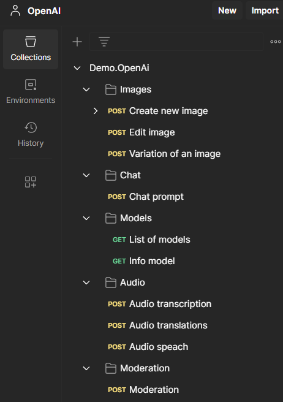

# iris-openAi
Libraries to use the OpenAI API methods in a simple way and integrated with an IRIS production

## The idea
There are some libraries for connecting to the OpenAI API via Python, Java, C#, etc., but no library for ObjectScript.
With these classes, you can connect directly to the OpenAI API, and you can interact with them only using request and response messages prepared to connect to OpenAI.

## Prerequisites
Make sure you have [git](https://git-scm.com/book/en/v2/Getting-Started-Installing-Git) and [Docker desktop](https://www.docker.com/products/docker-desktop) installed.

## Installation 

- Clone/git pull the repo into any local directory

```powershell

git clone https://github.com/KurroLopez/iris-openai.git .\iris-openai

```

Open the terminal in this directory and run:

```
$ docker-compose build
```

3. Run the IRIS container with your project:

```
$ docker-compose up -d
```

## How to use it
Step 1: Create your production and insert a new Business Operation called "Banksia.OpenAi.OpenAi" using the class with the same name.


Step 2: Modify the component's properties to include the Secret Key and OrganizationID


## How to Test it
There is a demo created in this composition to check the connection with OpenAI.

Also, there is a Postman collection exported to test. It's prepared to connecto with Docker compose.

